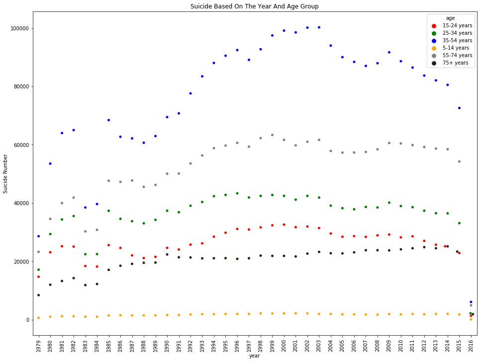
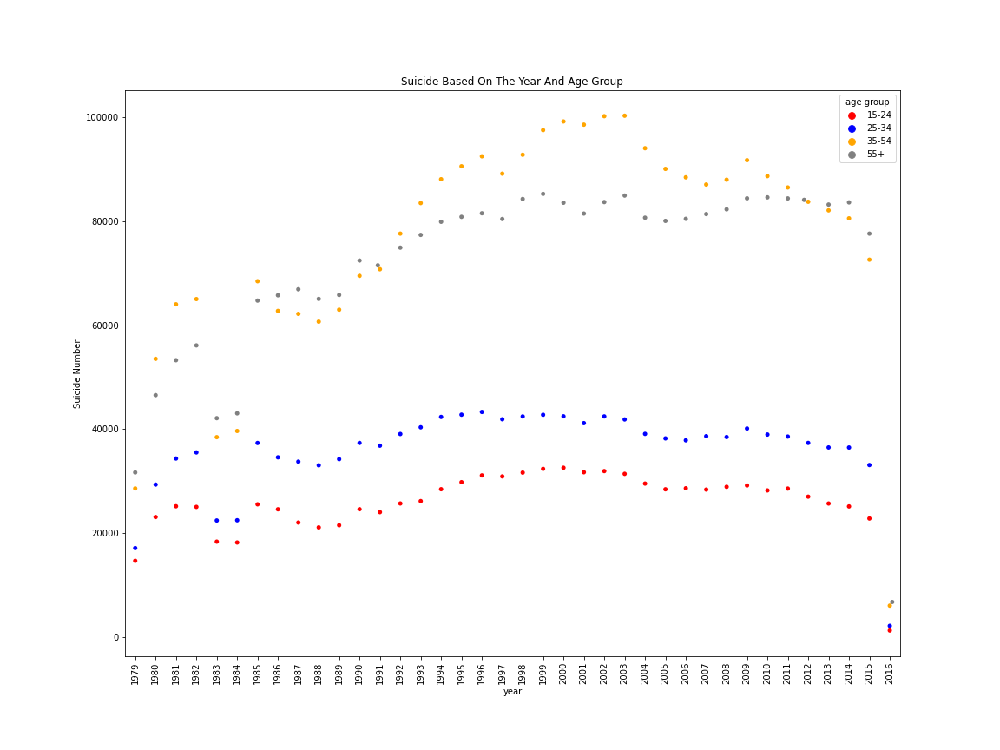
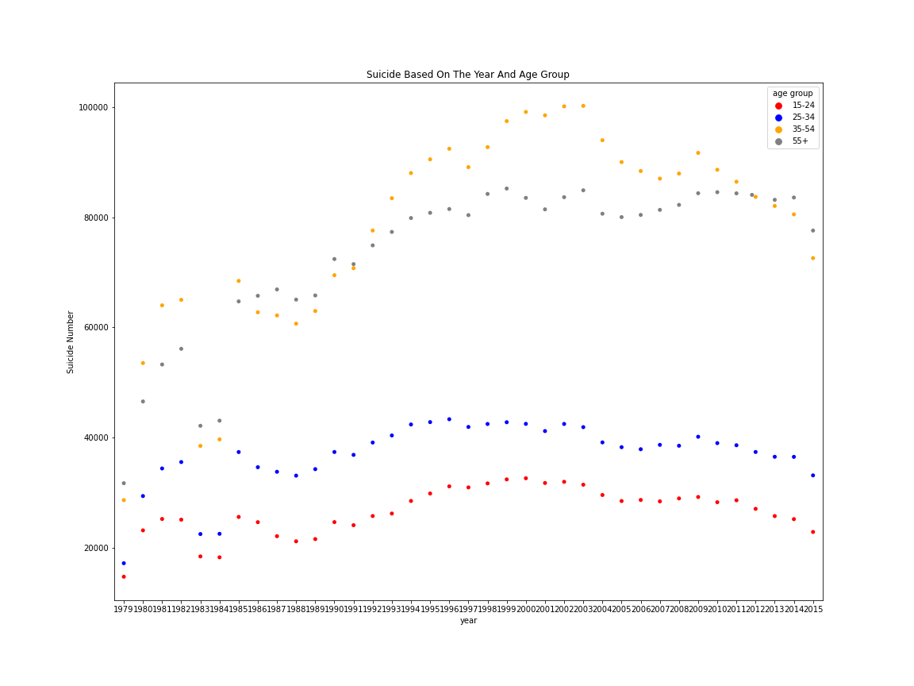
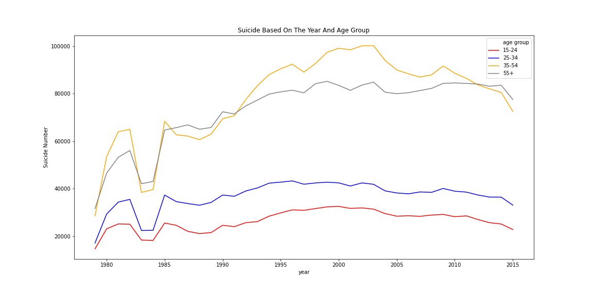
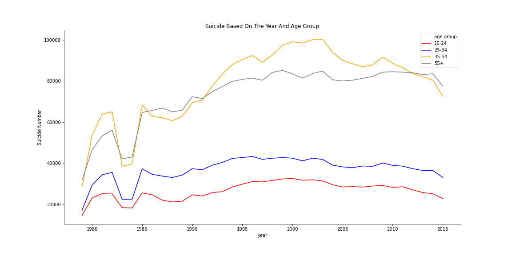
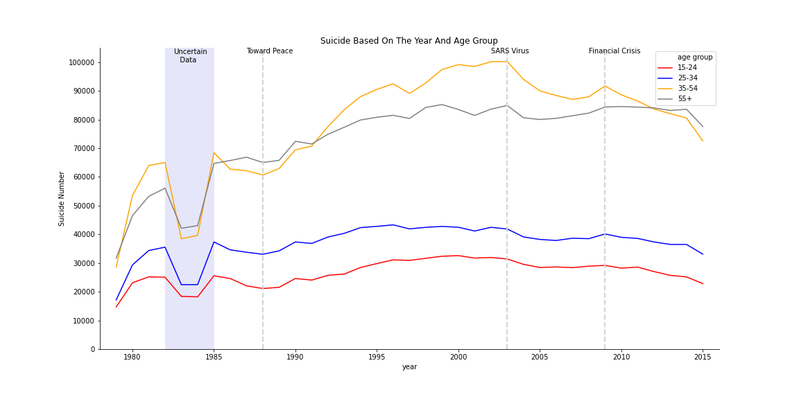
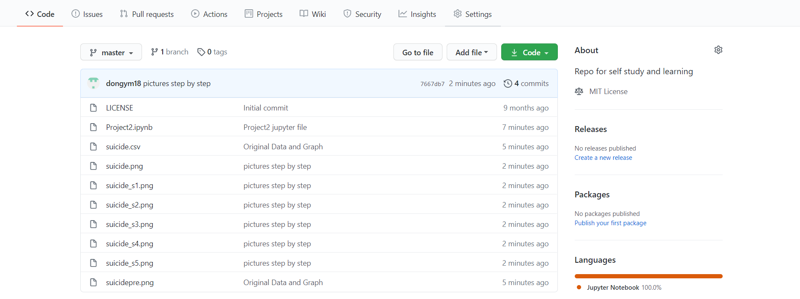

# Report for InforVis Project2 of Group 21

Group Information
>* Group id: 21
> * Gumber1:Guoxi Lin	320180940501
> * Gumber2:Shuhai Cao 320180939551
> * Gumber3:Yunming Dong 320180939701

https://github.com/dongym18/dym-lzu-learn.git

## 1.Abstract

In this report, we choose the suicide statistics of the World Health Organization as the data source for our completion of this task. It is specifically about the number of suicide people of different ages in different time periods and countries, and population under corresponding conditions. We found a statistical graph to display the data, but because this graph has many problems that make it difficult to read, we modified it by merging the age group and transfering the type of the graph and show the result at the end.

## 2.Introduction

Under exactly the same conditions, the number of suicides in each age group should be relatively stable. If the number of suicides changes significantly in a certain period of time, it means that a certain event in the year affected the number of suicides. There are many factors influencing suicide, such as unemployment, bad marriages, unequal encounters, etc. All kinds of pressure will cause some people to think of suicide. Combining the unemployment rate, divorce rate, and the occurrence of social events in this time period can be used to obtain a useful parameter, let’s call it the social suicide score. When a country’s social suicide score exceeds or approaches the critical value, the country can make appropriate adjustments to prevent more people from suicide, or it can temporarily decide to set up some festivals to reduce the burden on the people and decline the suicide rate. Through the data visualization, you can more intuitively understand which social events, world situations, social factors, and family factors have a greater impact on the suicide rate. The factors that have great impact can be assigned more weight when calculating the social suicide score. However, the visual analysis of the original website can't directly reflect these characteristics. The original visualization cannot convey the trend of suicide number directly to its readers and the scrambled  colorful points with vertical x labels make it even harder to understand the idea. We hope to optimize this visualization to make it really play the above-mentioned role. We will use the methods of transfering the graph type, erasing useless ink and  emphasizing to achieve this.

## 3.About the Data

Suicide, the second biggest reason for people's death in the world, has killed 800,000 people every year before, which include people in our age. There will be one person committing suicide every 40 seconds in average. There are one billion people in the world have mental problems, however, only few of them can accept professional psychotherapy. We want to imporve the visualization to help the author stress the importance of preventing suicide better. In our opinion, the awareness of public have to be raised before any specific action taken. We hope more people can notice the mental problems for both themselves and their loves.

We searched the Internet for the visualization of this WHO suicide dataset, and finally found one that 135k persons view in the Kaggle and 21.7k persons has downloaded the dataset. It means the situatioin is very impactive in the society that a large number of persons are noticed the problem.

So we have a look at the picture and analyze the dataset

1. The minimum point of 1988. The withdrawal of the Soviet troops from Afghanistan in 1988, the end of the Iran-Iraq War, and the end of the 13-year civil war in Angola, etc., led to the gradual development of the world towards peace, and the number of suicides worldwide dropped to a minimum.

2. The maximum point in 2004. In 2003, the SARS virus raged around the world, with insufficient medical facilities, insufficient funds, and deaths of loved ones. Various social pressures pushed the number of suicides to the maximum.
3. The maximum point in 2009. The 2008 world financial crisis pushed the number of suicides on a downward trend to a maximum again.

It can be seen from the above typical cases that changes in the world pattern, wars, economic development, etc. will cause large fluctuations in the number of suicides. By consulting the visual graph of the number of suicides, we can gain a deeper understanding of the impact of international events on society. This shows that it is very necessary to visualize the number of suicides by time period and age group.

## 4.Analyze the Visualization

#### Advantages:
1. This visualization uses several colors with similar vividness, which will prevent the depth of the color from occupying the cognitive tunnel. Readers can evenly focus on the data of each age group instead of ignoring/over paying attention to certain Data for an age group (color).
2. The size and shape of each data point are the same. This can prevent readers from cognizing that some data is more important than others.

#### Disadvantages:
1. If it is observed that the dots of a certain color in a certain year are more prominent (higher or lower) than the dots of the same color at other times, it means that there have been some incidents affecting the number of suicides in that year, and further explanation The social pressure this year was higher/lower than in previous years.
2. In the visualization given on the original website, the factors of demographic changes are not considered. This adds other visual variables to the observation and affects the observation results.
3. Our working memory is a short-term memory, but the visualization has too many age ranges, and the vertical and abscissa labels are used. When people look up the visualization, it often takes more time to determine a certain When a point belongs to which color and year, determine the size of the data after determining these variables. At this time, because the short-term memory 300ms-500ms will disappear, it is easy for people to forget the previously determined factors and need to search repeatedly. The specific data at a certain point can be determined only once.
4. There are four coordinate axis frames in this visualization, which is a kind of redundant visual data, which will affect the process of our brain processing other visual data.
5. Some data points are too dense. Our brain may process these data points in other ways, such as imagining as some specific graphics, which hinder the cognition of the data itself.

All in all, there are a lot of thing need to be imporved.
__________
## 5.Trying to Fix up

We have used the knowledge we have learned and considered part of the modification methods from the user's perspective, so that we can better display the data and highlight our visualization purpose to prevent misunderstandings.

1. Combine 6 age groups into 4 age groups, and label the age. The data points on the original image have many overlapping parts, and the mixing of multiple colors makes the image look very difficult to distinguish. Suicide is basically impossible in infants, and it is not necessary to separate them into one category. After the merger, the number of data points will drop sharply, and it has practical meaning, which can express the psychological endurance or pressure of people in different periods.
 
2. We remove the data for 2016, because the statistic of this year is incomplete.
 
3. Subdivide the coordinates of the vertical axis. At present, the span of each data on the vertical axis is very large, and it is difficult to estimate the size of each data. It is convenient to check the data after subdividing the coordinate axis.
  
4. We do not use red and green at the same time. In red-green blindness, red and green are very difficult to distinguish, which will lead to some absurd conclusions, such as the impact of the economic crisis on people in 15-24 years old more than it does on people in 25-34 years old. Colors that are easy to distinguish, so most readers can read without pressure.
5. Change the point graph to a line graph. The dot map does not reflect the trend of change well. The fault in the middle will affect people's judgment. After connecting, it can clearly reflect the change of the number of suicides over time, and the increase or decrease of the social happiness index can be roughly seen.
  
6. Change the years of the horizontal axis to horizontal, and change the horizontal coordinates of the sparsely distributed years to one axis every 5 years. Vertical tags will affect reading, and changing to horizontal display can prevent readers from focusing too much on identifying the year.
7. Remove the top and right borders. The human brain can only process 1% of visual data. Any redundant visual data will affect the brain's analytical data.
Here comes the operation.
 
8. In order to make the visualization more readable, we emphasize some specific years with annotation. Our purpose is to make our readers understand what happened which affected the number of suicide people. After we confirm that the data from 1982 to 1985 is also incomplete, we change the background color on that period with annotation.
 
9.  Change the data on the vertical axis to suicide rate/suicide ratio to produce another graph. The world’s population will change drastically after certain major events (such as the decisive battle of the world war and the end of the world war). The drastic change in the population will lead to a drastic change in the number of suicides. This does not fully match the impact of current major events and will affect Reader's judgment. Changing to the suicide rate can maintain a single variable and reduce the impact of demographic changes on suicide.
  

## 6.End of the Story

We try to reproduce our ideas, the effect is as follows:

It can be said that the conclusion is clearer and the user's senses are better.The whole picture has become more concise. Due to the addition of several emphasized lines (dashed lines), some specific major events in the source data are the changes in the data that have been emphasized, giving me a more intuitive feeling. At the same time, the composition of the picture is more comfortable, and there is no case of repeatedly looking at the legend.

------

## 7. Conclusion
In this project, we summarized a few rules that must be considered in visualization:
1. The data itself must be considered, such as major events or emphasized points, which must be reflected without sacrificing the simplicity of the picture.
2. Do not allow users to perform redundant operations while reading the picture, such as reading the legend in reverse, watching the legend repeatedly, etc.
3. The pictures should be as concise as possible, choose correct and concise statistical graphics, and do not pursue complexity.
4. Remember to use cognitive psychology: Remember, users are very "stupid".

-----

## 8. Publish
> Github repository: https://github.com/dongym18/dym-lzu-learn.git
  

Here we publish our work into githup so that others can have a look at what we did and give some comments.

**The world is not perfect, when you are in darkness, remember to be brave!**